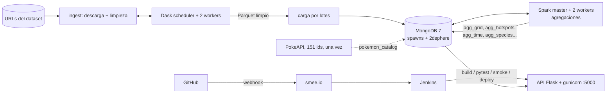

# Pokémon GO geoespacial — Big Data con Dask, Spark, MongoDB, Flask y Jenkins

Sistema contenerizado que descarga un dataset geoespacial real (≈ 9 M de avistamientos de Pokémon GO, 2016),
lo limpia con **Dask**, lo guarda en **MongoDB** como GeoJSON con índice `2dsphere`, calcula agregaciones espaciales y
temporales con **Spark**, expone consultas geoespaciales mediante una API **Flask** y se construye, prueba y despliega con
**Jenkins** disparado por un webhook de GitHub. Trabajo individual, curso de Big Data (IUE).

- Informe técnico y decisiones: [`docs/PLAN_DE_TRABAJO.md`](docs/PLAN_DE_TRABAJO.md) (perfilado, reglas de limpieza, fases).
- Benchmark Dask vs Spark: [`benchmark/README.md`](benchmark/README.md).

## Arquitectura



| Servicio | Imagen | Función | Puerto local |
|---|---|---|---|
| `mongo` | `mongo:7.0` | Almacenamiento GeoJSON + índice `2dsphere` | 27017 |
| `dask-scheduler`, `dask-worker-1/2` | `bigdata-ingest` | Limpieza distribuida y carga por lotes | 8786, 8787 (panel) |
| `spark-master`, `spark-worker`, `spark-worker-2` | `apache/spark:3.5.3` | Agregaciones con el conector de MongoDB | 7077, 8080 |
| `api` | `bigdata-api` | API Flask + gunicorn | 5000 |
| `jenkins` | `bigdata-jenkins` | CI/CD (Docker CLI + socket del host) | 8088 |
| `smee` (perfil `webhook`) | `node:20-alpine` | Puente GitHub → Jenkins local | — |

Presupuesto de memoria ≈ 6,5 GB (Docker Desktop con ≥ 8 GB). Espacio en disco ≈ 10 GB (dataset descomprimido ≈ 2 GB + imágenes + MongoDB).

## Levantar el sistema desde cero

Requisitos: Docker con Compose v2 y conexión a internet. Nada más (Python no hace falta en el host).

```bash
git clone https://github.com/elrios893/pokemon-geo-bigdata.git && cd pokemon-geo-bigdata
cp .env.example .env            # editar MONGO_PASSWORD (el archivo .env NO se versiona)

docker compose up -d --build                          # mongo, dask, spark, api, jenkins
docker compose --profile ingest run --rm ingest       # descarga -> limpieza (Dask) -> carga a MongoDB (≈ 10–15 min con la descarga)
docker compose --profile spark run --rm spark-job     # agregaciones de Spark -> colecciones agg_* (≈ 2 min)
```

Comprobación: `curl localhost:5000/health` → `{"status":"ok","mongo":"up"}`.

La ingesta es **idempotente y automática**: descarga los 4 ZIP (≈ 1,2 GB; se omiten si ya existen y son válidos),
limpia, escribe Parquet en `data/clean/` y recarga la colección. Variables útiles (en `.env` o con `-e`):
`SAMPLE_STRIDE=4` (una de cada K líneas; `1` = los 8,9 M completos), `GRID_DEG=0.01` (celda de ≈ 1,1 km).

## API

Todas las consultas son parametrizadas (no hay coordenadas ni radios fijos en el código); las entradas inválidas devuelven `400` con un mensaje.
Límites: radio ≤ 50 km, `limit` ≤ 1000, polígono ≤ 500 vértices, `maxTimeMS` = 8 s. Orden GeoJSON: `[longitud, latitud]`.

| Endpoint | Consulta MongoDB | Parámetros |
|---|---|---|
| `GET /near` | `$near` (por distancia) | `lat`, `lng`, `radius` (m), `pokemonId`, `limit` |
| `POST /within` | `$geoWithin` | cuerpo: GeoJSON `Polygon`/`Feature`; `pokemonId`, `limit`, `count=true` (añade `total`) |
| `GET /geonear` | agregación `$geoNear` (devuelve `distance_m`) | `lat`, `lng`, `radius`, `pokemonId`, `limit` |
| `GET /stats/hotspots` | resultados de Spark | `limit` |
| `GET /stats/grid` | resultados de Spark | `min_lat`, `max_lat`, `min_lng`, `max_lng`, `limit` |
| `GET /stats/time` | resultados de Spark | `granularity=hour\|dow\|day` |
| `GET /stats/species`, `/stats/species/<id>/hours` | resultados de Spark | `limit` |
| `GET /health` | ping a MongoDB | — |

```bash
# Avistamientos a 500 m de Times Square (solo Pidgey)
curl "localhost:5000/near?lat=40.758&lng=-73.9855&radius=500&pokemonId=16&limit=5"

# Dentro de un polígono (parte de Manhattan), con el total aunque el listado se limite
curl -X POST "localhost:5000/within?count=true&limit=5" -H "Content-Type: application/json" \
  -d '{"type":"Polygon","coordinates":[[[-74.02,40.70],[-73.93,40.70],[-73.93,40.80],[-74.02,40.80],[-74.02,40.70]]]}'

# Con distancia calculada ($geoNear)
curl "localhost:5000/geonear?lat=40.758&lng=-73.9855&radius=300&limit=3"

# Resultados de Spark: las celdas más densas (con puntos distintos y especies dominantes)
curl "localhost:5000/stats/hotspots?limit=3"
```

Cada avistamiento se enriquece con `name` y `types` desde el catálogo de PokeAPI guardado en MongoDB (la API nunca llama a PokeAPI).

## Modelo de datos

Colección `spawns` (≈ 2,24 M de documentos con `SAMPLE_STRIDE=4`):

```json
{ "_id": "57f0b15ff6b8ec00129e8e5e", "pokemonId": 118, "source": "SKIPLAGGED",
  "location": { "type": "Point", "coordinates": [-73.985619, 40.758286] },
  "appeared_utc": "2016-10-02T06:53:15Z", "local_date": "2016-10-02", "local_hour": 1, "local_dow": 6 }
```

Índices: `location_2dsphere`, `pokemonId_1`. Colecciones derivadas: `pokemon_catalog`, `agg_grid`, `agg_hotspots`, `agg_time`,
`agg_species`, `agg_species_hour`, `agg_type`. Reglas de limpieza y su justificación: [PLAN §7](docs/PLAN_DE_TRABAJO.md).

## Pruebas

```bash
docker run --rm bigdata-api:latest python -m pytest tests -q    # 59 pruebas de la API (base simulada)
python -m pytest tests/unit -q                                  # 16 pruebas de limpieza, carga y muestreo (requiere las dependencias de ingest/)
```

Las pruebas de humo (18 comprobaciones contra un MongoDB real efímero) las ejecuta el pipeline: `tests/smoke/smoke_api.py`.

## CI/CD con Jenkins

1. Jenkins en `http://localhost:8088`. Primera vez: `docker exec jenkins cat /var/jenkins_home/secrets/initialAdminPassword`, crear usuario.
   Los jobs se crean solos al arrancar (`jenkins/init.groovy.d/`): `pokemon-geo-bigdata` (construye `main`, lo dispara el webhook y despliega) y
   `pokemon-geo-bigdata-rama` (parámetro `BRANCH`: prueba una rama sin desplegar).
2. Webhook con Jenkins local: crear un canal en <https://smee.io/new>, guardarlo en `.env` como `SMEE_URL`, ejecutar
   `docker compose --profile webhook up -d smee` y crear en GitHub (Settings → Webhooks) un webhook con esa URL, tipo `application/json`, evento *push*.
3. Etapas del [`Jenkinsfile`](Jenkinsfile): checkout → validar compose → build de imágenes → pytest (API e ingesta) →
   stack efímero (`docker-compose.ci.yml`) + pruebas de humo → **deploy**. Cada etapa depende de la anterior, de modo que **si una prueba falla no se despliega**.
   Se despliega la misma imagen que pasó las pruebas, y solo el servicio `api`; las credenciales de MongoDB se leen del contenedor en ejecución (no hay secretos en el repo).

## Estructura del repositorio

```
docker-compose.yml  docker-compose.ci.yml  Jenkinsfile  .env.example
ingest/       descarga, limpieza (Dask), carga a MongoDB, catálogo de PokeAPI, perfilado
processing/   job de Spark (agregaciones)
api/          API Flask (validación, consultas, rutas) y sus pruebas
tests/        pruebas unitarias de ingesta y pruebas de humo
benchmark/    Dask vs Spark: scripts, resultados y análisis
jenkins/      imagen de Jenkins y jobs como código
docs/         plan de trabajo, perfilado y decisiones
```

## Decisiones y hallazgos destacados

- **Hora local derivada:** el campo `localTime` del dataset no es hora local real (Nueva York aparece en UTC−5 en septiembre, Ámsterdam en UTC+0). Se calcula como `UTC + round(longitud × 4) min`.
- **Muestreo sistemático** (una de cada 4 líneas, ≈ 2,24 M): conserva la distribución semanal de la población; las primeras N filas dejaban 0,7 % de viernes frente al 7,4 % real.
- **Los puntos se repiten:** en la población completa el 81 % de los avistamientos cae en coordenadas vistas más de una vez (puntos de aparición). No se eliminan: son observaciones distintas y su relación es una señal (un punto de agua vuelve a dar agua el 66 % de las veces). Los hotspots incluyen `puntos_distintos` para separar tráfico de cantidad de puntos ([PLAN §2.9](docs/PLAN_DE_TRABAJO.md)).
- **Dask vs Spark** con 2,24 M de filas: Dask fue más rápido (2,1 s frente a 4,6 s con 4 núcleos) y usó menos memoria; no se midió con el volumen completo ([benchmark](benchmark/README.md)).
- **Sesgo de la fuente:** el 90,6 % de los datos viene de una app (POKERADAR); los hotspots reflejan dónde había usuarios, no la densidad real de apariciones.

## Limitaciones

- La API no tiene autenticación ni límite de peticiones (entorno local de la práctica).
- `/within` devuelve a lo sumo `limit` registros; el total solo se calcula con `count=true`.
- El benchmark corre en un único equipo (cluster simulado) y solo hasta 2,24 M de filas.

## Fuentes y créditos

- Dataset "Catch Them All" (Pokémon GO, avistamientos 2016), publicado en los foros del dataset *Predict'em All* de Kaggle: <https://www.kaggle.com/datasets/semioniy/predictemall/discussion/24246>. Los ZIP se descargan de las URL adjuntas de esa discusión (`ingest/download.py`).
- Catálogo de especies: [PokeAPI](https://pokeapi.co/) (151 consultas, una sola vez; resultado versionado en `data/catalog/`).
- Conector de MongoDB para Spark 10.4: <https://www.mongodb.com/docs/spark-connector/v10.4/>. Imágenes oficiales: `mongo`, `apache/spark`, `jenkins/jenkins`.
- Puente de webhooks: [smee.io](https://smee.io/) y `smee-client`.
- Patrón de agregación personalizada de Dask (probado y descartado por lento): <https://docs.dask.org/en/stable/generated/dask.dataframe.Aggregation.html>.
- Todo el código del repositorio es propio, escrito para este trabajo; no se tomó código de otros equipos ni de repositorios públicos.
