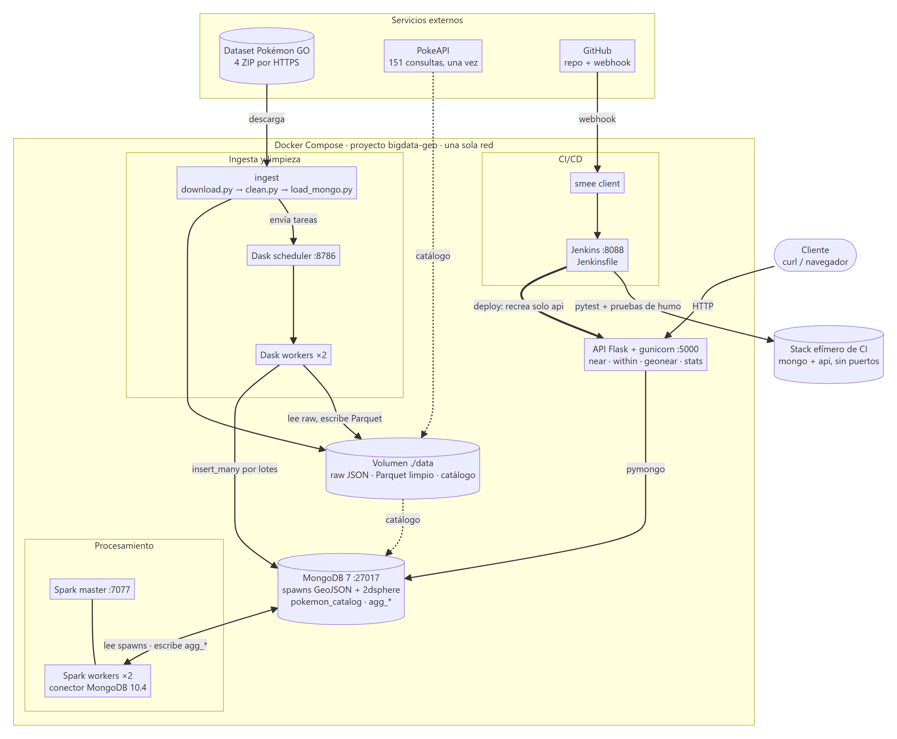
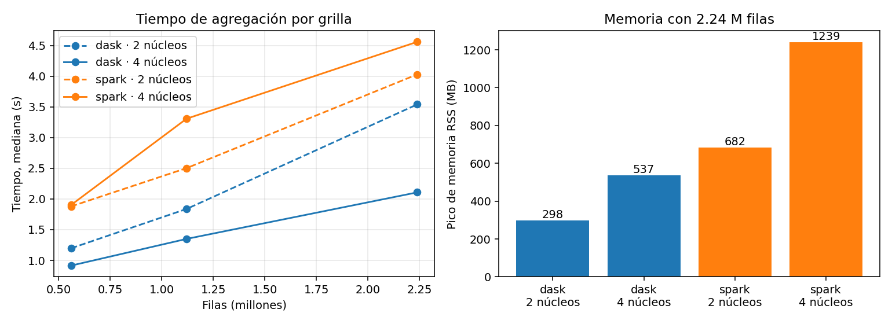

# Sistema geoespacial de Big Data con Dask, Spark, MongoDB, Flask y Jenkins

> **Informe técnico** · Avistamientos de Pokémon GO (≈ 9 M de registros)  
> Trabajo individual · Big Data · Institución Universitaria de Envigado (IUE) · Docente: Andrés Felipe Hernández Marulanda · Entrega: 9 de octubre de 2026  
> Repositorio: <https://github.com/elrios893/pokemon-geo-bigdata>

## 1. Resumen

Se construyó un sistema contenerizado que descarga automáticamente un dataset geoespacial real, lo limpia con Dask, lo almacena en MongoDB como GeoJSON con índice 2dsphere, calcula agregaciones espaciales y temporales con Spark y expone consultas geoespaciales parametrizadas mediante una API Flask. Un pipeline de Jenkins, disparado por un webhook de GitHub, construye las imágenes, ejecuta pruebas unitarias y de humo y solo despliega si todas pasan. El sistema se levanta con `docker compose` y tres comandos (ver README). Se comparan Dask y Spark con una misma agregación por grilla, con mediciones propias de tiempo y memoria.

**Dataset.** «Catch Them All», avistamientos de Pokémon GO (julio–octubre de 2016), publicado en el foro del dataset *Predict'em All* de Kaggle: 8.964.844 filas en 4 archivos JSON (≈ 2 GB descomprimidos) con coordenadas, especie (`pokemonId` 1–151), fuente de la app y fecha UTC. Cumple el mínimo del enunciado (≥ 1 M de registros o 1 GB).

## 2. Arquitectura

Seis componentes (diez contenedores) en una sola red de Docker Compose (`bigdata-geo`); el diagrama de la Figura 1 muestra cómo se conectan.

| Servicio | Tecnología | Decisión |
|---|---|---|
| `mongo` | MongoDB 7.0 | GeoJSON e índice 2dsphere nativos; consultas `$near`, `$geoWithin` y `$geoNear`. |
| `dask-scheduler` + 2 workers | Dask 2024.12 | Lectura particionada y limpieza distribuida; una sola imagen para scheduler, workers y cliente (las versiones deben coincidir). |
| `spark-master` + 2 workers | Spark 3.5.3 + conector MongoDB 10.4 | Lee de MongoDB y escribe colecciones nuevas; dos workers de 2 núcleos, igual que Dask, para el benchmark. |
| `api` | Flask 3 + gunicorn | Endpoints con validación; la lógica de consulta son funciones puras, fáciles de probar. |
| `jenkins` | Jenkins LTS (JDK 17) | Usa el daemon Docker del host (socket); los jobs están definidos como código. |
| `smee` | smee-client 2.0.4 | Reenvía el webhook de GitHub al Jenkins local, que no tiene IP pública. |

*Figura 1. Arquitectura: datos (descarga → Dask → MongoDB → Spark → API) y CI/CD (GitHub → smee → Jenkins). Fuente del diagrama: `docs/img/arquitectura.mmd` (Mermaid).*

**Cobertura del enunciado.**

| Requisito | Componente |
|---|---|
| Descarga automática y reproducible | `ingest/download.py`: valida el ZIP y su tamaño, es idempotente |
| Limpieza con Dask, justificada | `ingest/cleaning.py` + `clean.py` (sección 3) |
| GeoJSON + índice 2dsphere, carga por lotes | `ingest/load_mongo.py` (`insert_many` por partición) |
| Agregaciones espaciales y temporales con Spark | `processing/jobs/aggregate.py` (sección 5) |
| `$near`, `$geoWithin`, `$geoNear` parametrizadas | `api/app/queries.py` (sección 4) |
| API con ≥ 3 endpoints | `api/app/routes.py` (sección 6) |
| Jenkins con webhook, pytest, humo y despliegue condicionado | `Jenkinsfile` (sección 7) |
| Dask frente a Spark con mediciones propias | `benchmark/` (sección 8) |
| Sin secretos en el repositorio | `.env` ignorado; solo `.env.example` versionado |

## 3. Ingesta y limpieza (Dask)

La descarga (`ingest/download.py`) baja los 4 ZIP, valida cada archivo y omite lo ya descargado. Se usan las URL adjuntas del foro del dataset en Kaggle, no la API de Kaggle, porque los archivos solo existen allí. La limpieza (`ingest/clean.py`) lee cada archivo por bloques de 200.000 líneas como tareas de Dask, aplica reglas puras (`ingest/cleaning.py`, con pruebas unitarias), deduplica globalmente y escribe Parquet. Antes se perfiló el dataset completo (`ingest/profile_data.py`) para fundamentar cada regla:

| Regla | Filas afectadas (dataset completo) | Justificación |
|---|---|---|
| Coordenadas nulas, no numéricas, fuera de rango o (0,0) | 0 | Se implementa como defensa; el perfilado muestra 100 % de coordenadas válidas y se reporta que no elimina nada. |
| Descartar filas sin `pokemonId` (o fuera de 1–151) | 3.993 (0,045 %) | Sin la especie no se puede enriquecer ni agregar por especie. |
| Deduplicar por (`pokemonId`, lng, lat, fecha UTC) | 11.940 (0,133 %) | Mismo evento reportado dos veces; no hay `_id` repetidos, así que no es un artefacto de las partes. |
| Aplanar fechas extendidas de Mongo (`$date`, `$oid`) | — | Convertir a datetime UTC e identificador de texto. |
| No usar `localTime` del dataset como hora local | — | Verificado que no es hora local: Nueva York aparece en UTC−5 en septiembre (real UTC−4) y Ámsterdam en UTC+0 (real +2). Se deriva: UTC + round(lng × 4) minutos. |
| Construir `location` como GeoJSON Point `[lng, lat]` | — | Orden GeoJSON longitud-latitud; requisito de 2dsphere. |

**Muestreo.** El dataset completo con MongoDB, imágenes y volúmenes no cabe cómodamente en el equipo, y el enunciado permite una muestra de ≥ 1 M de registros si la descarga completa está automatizada. Se toma una de cada 4 líneas (`SAMPLE_STRIDE=4`): 2.241.212 líneas leídas → 1.007 sin `pokemonId` → 735 duplicados → **2.239.470 documentos**. La primera versión tomaba las primeras 500.000 filas de cada archivo; al medir la población completa se vio que sesgaba el calendario (viernes: 0,7 % de la muestra frente a 7,4 % real). El muestreo sistemático conserva esa distribución.

**Carga.** Cada worker de Dask inserta su partición con `insert_many` (`ordered=False`, tolerando claves duplicadas, por lo que es idempotente). Los workers reciben la URI de MongoDB por variable de entorno, de modo que la clave no viaja por el grafo de tareas.

## 4. Modelo de datos y consultas geoespaciales

Cada documento de `spawns` (2.239.470; 485 MB de datos y 76 MB de índices) tiene la forma `{_id, pokemonId, source, location: {type: "Point", coordinates: [lng, lat]}, appeared_utc, local_date, local_hour, local_dow}`. Índices: `location_2dsphere` y `pokemonId_1`. El catálogo de especies (nombre, tipos) viene de PokeAPI: 151 consultas una sola vez, con pausas y reintentos, guardadas en `data/catalog` y cargadas en `pokemon_catalog`; la API nunca llama a PokeAPI.

Las tres consultas exigidas se construyen en `api/app/queries.py` con parámetros, nunca con valores fijos. Medidas con `explain('executionStats')`, primera ejecución con caché fría y límite de 1.000 resultados:

| Consulta | Parámetros | Tiempo | Docs examinados | Índice |
|---|---|---|---|---|
| `$near` (radio) | lat, lng, radio = 500 m | 606 ms | 1.822 | 2dsphere |
| `$near` + filtro de especie | radio = 500 m, `pokemonId` = 16 | 417 ms | 7.285 | 2dsphere |
| `$geoWithin` (polígono) | caja sobre Manhattan; 40.152 resultados en total | 198 ms | 1.136 | 2dsphere |
| `$geoNear` (agregación) | radio = 300 m, límite 3; distancias 33, 33, 33 m | 88 ms | — | 2dsphere |

Son mediciones únicas que varían con la caché; sirven como orden de magnitud (menos de un segundo con índice). Las consultas inválidas se rechazan antes de llegar a la base (400 con mensaje): radio > 50 km, polígonos abiertos o de más de 500 vértices, coordenadas fuera de rango. Los polígonos autointersectados los rechaza MongoDB y la API los convierte en 400.

## 5. Procesamiento con Spark

El job `processing/jobs/aggregate.py` lee `spawns` y `pokemon_catalog` con el conector oficial y escribe seis colecciones: `agg_grid` (conteo, especies y puntos distintos por celda de 0,01° ≈ 1,1 km; 244.738 celdas), `agg_hotspots` (las 200 celdas más densas con sus tres especies dominantes), `agg_time` (por hora local, día de la semana y fecha), `agg_species`, `agg_species_hour` y `agg_type`. El identificador de cada documento es determinista, de modo que volver a ejecutar sobrescribe sin duplicar.

**Verificación.** El propio job comprueba (`assert`) que el total de documentos coincide con la suma de la grilla, de las horas y de las especies (2.239.470). Además, los resultados se contrastaron con agregaciones hechas directamente en MongoDB, sin Spark, con cero diferencias. Por ejemplo, la celda más densa (Central Park, Nueva York) tiene 5.269 avistamientos en 982 puntos distintos, y el conteo independiente de puntos distintos da 982. La hora local pico es las 10 h.

## 6. API Flask

| Endpoint | Función |
|---|---|
| `GET /near?lat&lng&radius[&pokemonId&limit]` | Registros cercanos, ordenados por distancia (`$near`). |
| `POST /within[?count=true]` (cuerpo: GeoJSON Polygon o Feature) | Registros dentro del polígono (`$geoWithin`); con `count=true` añade el total aunque el listado esté limitado. |
| `GET /geonear?lat&lng&radius` | Registros con distancia calculada (`distance_m`) mediante `$geoNear`. |
| `GET /stats/hotspots`, `/grid`, `/time`, `/species`, `/species/<id>/hours` | Resultados calculados con Spark. |
| `GET /health` | Estado de la API y de MongoDB. |

Cada resultado se enriquece con nombre y tipos de la especie. Límites: radio ≤ 50 km, `limit` ≤ 1.000, polígono ≤ 500 vértices, `maxTimeMS` = 8 s; los errores inesperados devuelven 500 sin filtrar detalles internos. Hay 59 pruebas unitarias de la API con una base simulada que registra la consulta exacta recibida; una prueba de mutación (invertir `[lng, lat]` en `point()`) hace fallar 2 de ellas.

## 7. Integración y despliegue continuo

El `Jenkinsfile` declarativo tiene siete etapas: checkout, validación de los compose, construcción de imágenes, pruebas unitarias de la API (59) y de la ingesta (16), stack efímero (`docker-compose.ci.yml`: MongoDB en memoria y la API, sin puertos publicados) con 18 pruebas de humo contra una base real, y despliegue. Cada etapa depende de la anterior; el despliegue es la última, así que un fallo previo lo omite. Se despliega la misma imagen que pasó las pruebas (se re-etiqueta) y solo el servicio `api`, sin tocar MongoDB ni sus datos.

- **Disparo.** El job `pokemon-geo-bigdata` construye `main` y se dispara con el webhook de GitHub (vía smee.io). Verificado: el merge de un PR a `main` inició el build solo («Started by GitHub push»), pasó todas las etapas y desplegó la API.
- **Un fallo bloquea el despliegue.** Se introdujo un test roto a propósito en una rama de prueba: falló con «1 failed, 58 passed» y las etapas de ingesta, humo y despliegue quedaron omitidas («skipped due to earlier failure»).
- **Dificultad resuelta.** Jenkins usa el daemon Docker del host, que no ve las rutas de su workspace; por eso las pruebas copian archivos con `docker cp` en lugar de montar volúmenes, y el despliegue solo recrea el servicio `api`, que no tiene volúmenes con rutas del workspace.
- **Probar ramas.** Un segundo job (`pokemon-geo-bigdata-rama`, parámetro `BRANCH`) prueba una rama sin desplegar. Hizo falta porque el sondeo del webhook no expande parámetros en la rama.

## 8. Comparación Dask frente a Spark

**Operación.** Asignar cada avistamiento a una celda de 0,01° y contar, por celda, avistamientos y especies distintas; el resultado completo vuelve al driver. Ambos motores leen el mismo Parquet limpio y producen exactamente el mismo resultado (se verifica antes de comparar). Configuraciones: 1 worker (2 núcleos) y 2 workers (4 núcleos) en cada motor; 0,56, 1,12 y 2,24 M de filas. Por combinación: workers reiniciados, una corrida de calentamiento descartada y tres medidas (mediana). Memoria: pico de RSS de los procesos que participan.

| Motor | Núcleos | 0,56 M filas (s) | 1,12 M filas (s) | 2,24 M filas (s) | Pico RSS con 2,24 M (MB) |
|---|---|---|---|---|---|
| Dask | 2 | 1,20 | 1,84 | 3,54 | 298 |
| Dask | 4 | 0,92 | 1,35 | 2,11 | 537 |
| Spark | 2 | 1,88 | 2,50 | 4,03 | 682 |
| Spark | 4 | 1,90 | 3,31 | 4,56 | 1.239 |

*Figura 2. Tiempo (mediana) y memoria de la agregación por grilla.*

**Qué muestran los resultados.**

- **Dask fue más rápido y ligero a este tamaño.** Con 2,24 M de filas tardó 2,1 s con 4 núcleos frente a 4,6 s de Spark (2,2 veces) y usó 537 MB frente a 1.239 MB. Con 2 núcleos la diferencia es menor (3,5 s frente a 4,0 s).
- **Escalado.** Dask mejoró 1,7 veces al duplicar los núcleos; Spark no mejoró (4,0 s a 4,6 s). No se midió la causa; lo esperable es que con unos pocos millones de filas dominen la planificación, el *shuffle* y la serialización sobre el cálculo.
- **Arranque en frío.** La primera corrida de Spark tardó unos 11 s frente a 2,6–4 s en Dask. Importa si cada consulta arranca en frío.
- **Un hallazgo sobre el uso de Dask.** El `nunique` nativo del *groupby* de Dask (con conjuntos de Python) fue unas 12 veces más lento (13 s frente a 1,1 s con 0,56 M de filas). Se usó la forma equivalente a la que hace Spark internamente (deduplicar celda-especie y contar), con el mismo resultado; un benchmark ingenuo habría favorecido a Spark.

**Cuándo conviene cada uno (a partir de estos resultados).** Con datos que caben en la memoria agregada del cluster y trabajo en Python, Dask resultó más rápido, simple y barato en memoria. Spark aporta un optimizador y un motor de *shuffle* robustos y el conector con MongoDB; su ventaja es esperable cuando el volumen supera la memoria o el trabajo es SQL pesado, pero con 2,24 M de filas en un solo equipo no se manifestó. No se midió con los 8,9 M de filas completos ni en máquinas separadas: eso es una hipótesis, no un resultado.

## 9. Evaluación de la arquitectura

**Qué está bien planteado.**

- **Responsabilidades separadas.** Almacenamiento (MongoDB), limpieza (Dask), cálculo analítico (Spark), servicio (API) y CI/CD (Jenkins) son servicios independientes que se comunican por red; la API es *stateless* y puede escalar con más procesos.
- **Idempotencia.** La descarga, la carga (`_id` original) y las agregaciones (`_id` determinista) pueden repetirse sin duplicar datos.
- **Lógica pura y probada.** Limpieza, validación y constructores de consulta no dependen de la base, de modo que se prueban sin MongoDB.
- **Lo que se prueba es lo que se despliega.** La imagen que pasa las pruebas es la misma que se re-etiqueta y se despliega; las pruebas de humo corren en un stack aislado y desechable.
- **Reproducibilidad.** Versiones fijadas, límites de memoria por servicio y un solo `docker compose`.

**Debilidades y su estado.** Es una arquitectura de laboratorio de un solo nodo; estas son las decisiones que no pasarían a producción tal cual:

| Hallazgo | Riesgo | Estado |
|---|---|---|
| Todos los puertos se publican en todas las interfaces (`0.0.0.0`), incluidos el scheduler de Dask (8786) y el master de Spark (7077), que no tienen autenticación: quien los alcance puede ejecutar código en el cluster. | Alto en una red compartida | No corregido. Propuesta: publicar solo `5000` y `8088`, y el resto en `127.0.0.1` o sin publicar. |
| La API, Dask y Spark usan el usuario administrador de MongoDB; la API solo lee. | Medio (sin mínimo privilegio) | No corregido. Propuesta: usuario de solo lectura para la API y uno de escritura para ingesta y Spark. |
| Jenkins corre como root con el socket de Docker del host: equivale a control del host. | Medio | Aceptado: es lo que permite construir con el daemon del host. Jenkins tiene usuario y contraseña; no debe exponerse. |
| El despliegue lee las credenciales del contenedor `mongo` en ejecución. | Bajo (acoplamiento) | Aceptado: evita guardar secretos. Alternativa: credenciales de Jenkins. |
| El webhook no usa secreto; el canal de smee es público. | Bajo: solo provoca un sondeo del repositorio; el cuerpo no se ejecuta | Aceptado. |
| Un solo nodo de MongoDB sin réplica y una sola red de Docker. | Bajo en este alcance (sin tolerancia a fallos) | Aceptado. |
| La API no tiene autenticación ni límite de peticiones. | Bajo (uso local) | Aceptado; declarado como limitación. |

## 10. Hallazgos sobre los datos

- **Los puntos se repiten.** En la población completa hay 3.148.518 coordenadas distintas para 8.944.697 avistamientos; el 81,2 % de los avistamientos cae en coordenadas vistas más de una vez (máximo 277 en un punto). Son puntos de aparición vistos repetidamente (el 99 % de los pares consecutivos son de la misma fuente), no eventos únicos.
- **Decisión: no eliminarlos.** Son observaciones distintas y su relación es una señal. El siguiente avistamiento en un mismo punto es de la misma especie el 25,1 % de las veces (5,7 % si fuera independiente), y un punto de agua vuelve a dar agua el 66,0 % de las veces (17,5 % global; 8,5 % si el anterior no era de agua). Un duplicado semántico (misma especie, mismo punto, ≤ 15 min) es solo el 1,07 % de la población.
- **Consecuencia para Spark.** Los hotspots miden tráfico (visitas y usuarios) además de puntos; por eso incluyen `puntos_distintos`. El primero tiene 5.269 avistamientos en 982 puntos.
- **Sesgo de la fuente.** El 90,6 % de los datos viene de una sola app (POKERADAR); los hotspots reflejan dónde había usuarios, no la densidad real de apariciones.

## 11. Limitaciones y trabajo futuro

- La muestra (2,24 M de 8,9 M) subestima la repetición espacial (58 % frente a 81 %). Con más disco se puede cargar todo con `SAMPLE_STRIDE=1`.
- El benchmark corre en un único equipo (cluster simulado, 12 CPU virtuales y 8 GB) y solo hasta 2,24 M de filas.
- Mejoras de seguridad de la sección 9 sin aplicar; `/within` devuelve a lo sumo `limit` registros (el total solo con `count=true`).
- La descarga usa las URL del foro de Kaggle en lugar de la API de Kaggle.
- La extensión con CS:GO quedó fuera de alcance. El mapa con Leaflet se incluyó como interfaz web sobre la misma API (README, sección «Interfaz web»).

## Fuentes

- Dataset «Catch Them All» (Pokémon GO, 2016), foro del dataset *Predict'em All*, Kaggle: <https://www.kaggle.com/datasets/semioniy/predictemall/discussion/24246>
- PokeAPI (catálogo de especies): <https://pokeapi.co/>
- MongoDB Spark Connector 10.4: <https://www.mongodb.com/docs/spark-connector/v10.4/>
- Dask, `dd.Aggregation` (patrón probado y descartado por lento): <https://docs.dask.org/en/stable/generated/dask.dataframe.Aggregation.html>
- Apache Spark 3.5.3, métricas de ejecutores: <https://spark.apache.org/docs/3.5.3/monitoring.html>
- smee.io y smee-client: <https://smee.io/>
- Mermaid (diagramas): <https://mermaid.js.org/>
- Imágenes oficiales de Docker Hub: `mongo`, `apache/spark`, `jenkins/jenkins`, `python`.

Todo el código del repositorio fue escrito para este trabajo; no se tomó código de otros equipos ni de repositorios públicos. La herramienta de conversión a PDF (`tools/docs_pdf`) es un script propio reutilizado de otro proyecto del autor.
